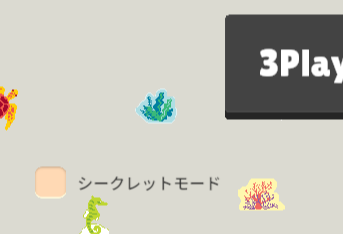
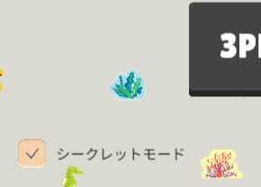
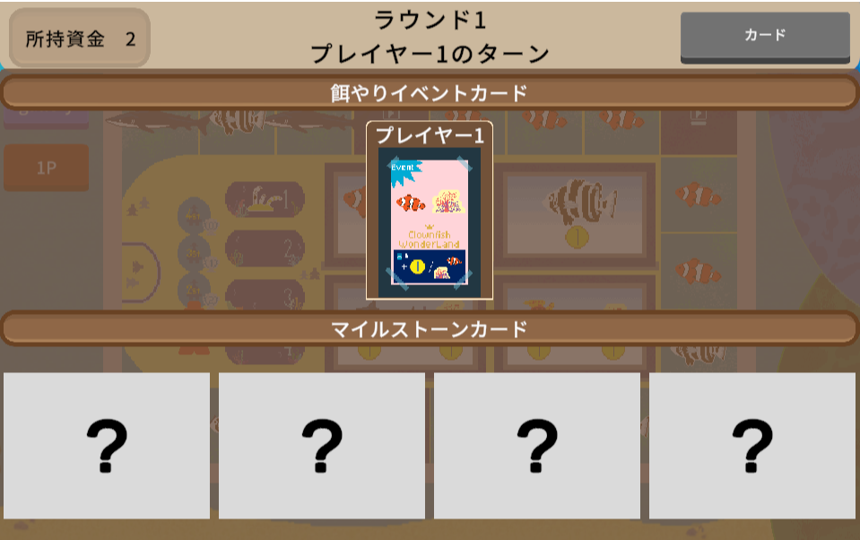

# AquaGarden(Web)
## AquaGardenについて
「そうだ、水族館作ろう」  
うちばこや様で好評販売中のオリジナルの水族館を作りスコアを競うボードゲームです。

## (Web)とは
AquaGardenは机いっぱいに広げて遊ぶ中量級ボードゲームであり、準備や片付けにも時間がかかるので手軽にプレイすることが難しいです。
そこで、Unityのスキルアップとしてデジタルゲーム化に挑戦しました。  
オリジナルポイントは以下の通りです。

- デジタルゲームだからこそできる表現や機能
- ユーザビリティの追求

## ターゲット
プレイ対象者はアクアガーデンをプレイ経験者としています。
理由は以下の通りです。

- ルールブックは公式サイトに掲載されている
- 慣れてしまえばルール確認機能は必要なくなる
- 開発期間の短さ（開発期限は1か月、職業訓練後の隙間時間）

## ゲームサンプル
[ゲームのサンプルプレイ](https://azumasato4.github.io/AquaGarden_web/)


### 操作方法
- クリックのみで操作可能

### ゲームルール
[うちばこや様のルールブック(PDF)](/Readme/aqua-garden-rulebook.pdf)

一部抜粋
- 大きく分けて**ギャラリーフェーズ**と**水族館フェーズ**の2つのフェーズがある。
- 基本的に「ギャラリー」→「水族館」の順番で実行し、やれることがなくなれば次のプレイヤーの番になる。
- **ギャラリーフェーズ**では、オーナー駒を動かし止まったマスにある「魚駒を取得」あるいは「広告を実施」する。
- **水族館フェーズ**では、飼育員駒を動かし止まったマスに隣接した水槽内に手に入れた魚駒を入れる。
- 特殊イベントとして「マイルストーン」と「餌やりイベント」がある。
- **マイルストーン**とは、条件を達成すると達成したプレイヤー順で得点が加算される。
- マイルストーンの条件を他のプレイヤーよりも早く達成すると、マイルストーン駒という駒を追加で手に入れることができる。
- **餌やりイベント**とは、特定のマスを飼育員駒が通った場合に自動で発生し資金を獲得することができる。
- 資金を消費して追加の魚駒を購入することも可能。

## 使用技術
- ゲームエンジン：Unity
- 使用言語：C#
- 使用ツール：VisualStudio, aseprite
- 使用アセット：DOTween(HOTeen v2), FarmGameUI-Starter2D

## 開発の工夫
- 開発期間：50時間（イラスト制作：10時間、基本設計：30時間、デバッグ：10時間）
- 担当範囲：企画、アセットの導入、イラスト制作、プログラミング、デバッグ仕上げ
- こだわった点：
  - 駒にアニメーションとSEをつけてデジタルゲームらしさ、視認性の向上を図った。
  - ボードゲーム版で制限されている行為（魚駒の配置条件、プレイヤーの移動条件など）を細かく再現した。
  - プレイヤーが直感的に操作できるように操作方法をクリックのみに限定した。
  - カメラ切り替え機能とカード表示機能を実装することで、実際のボードゲームのように状況判断ができ、戦略を立てやすくした。
  - ゲーム終了後に最終的な水族館の出来栄えを確認できるようにした。
  - PCとスマートフォンの両端末でプレイができるようにUIを調整した。
  - ユーザビリティを向上させるためにゲーム起動時の端末情報を取得して、基本操作をPCではシングルクリック、スマートフォンではダブルクリックに自動で切り替わるようにした。
  - 魚駒の情報などをデータ型にすることで管理や拡張をしやすくした。
- 技術的な調整で難しかった点：
  - 魚駒の移動条件が魚の種類によって違うので設定と確認、調整。
  - レイキャストを使用した当たり判定の切り替え。
  - PCでもスマートフォンでも同じような見栄えになるようにUIの配置や大きさの調整。


### オリジナルポイントの詳細
#### デジタルゲームだからこそできる表現や機能
- 魚駒、オーナー駒、飼育員駒などの動くものにアニメーションとSEをつけた。  
  →まるで生きているかのように表現をしたかったため。  
  
- マイルストーンカードの条件を隠す機能（シークレットモード）をオプションで選択可能にした。（1人でも条件を達成するとそのマイルストーンカードはその後は常に表示される）  
  →ボードゲーム版では表面にのみ条件が書いてあり第3者に判定をお願いするしかなかったが、デジタルゲームならば判定はコンピュータがしてくれるため容易に実現可能となり経験者でも新鮮な気持ちでプレイすることができるのではないかと考えたため。  
  →実装しプレイした結果、かなり運要素が強くなるため難易度が上がりすぎたかもしれない。4枚中2枚だけ条件を非表示だとちょうどいい難易度になった可能性あり。  
  
    
  
  

#### ユーザビリティの追求
- ギャラリーボードの広告イラストは画面上で見やすく、選択しやすくするために横長に変更した。  
  
    
- 水族館ボードの上部に魚駒を一時的に置くためのストレージ置き場を制作した。  
  
    
- PCではマウスホバーで選択可能なマスにシルエットが出現しシングルクリックで移動。
- スマートフォンではシングルクリックでシルエットが出現しダブルクリックで移動。  
  →PCではあまり気にならなかったが、スマートフォンで操作した際に押し間違いで操作してしまうことがあったためその予防策。  
   また、スマートフォンではマウスホバーと同様の操作をすると指で画面に表示されるシルエットが隠れてしまう問題もあったがこの変更により解消。  
      
- 禁止操作をした際にメッセージパネルを表示し、何がいけなかったのかを文章で伝える。  
  →プレイヤーが何がいけなかったのか理解しやすくするため。デバッグにも役立った。
  
  
- カメラ切り替えボタンで、同じプレイヤーボタンを押すと「ギャラリーカメラ」と「そのプレイヤーの水族館カメラ」を交互に切り替えられるようにした。  
  →この仕様の方がカーソル移動が最小限で済み操作感がよかったため。  
  
- 水槽内の酸素量を表示するようにした。  
  →ボードゲーム版では魚駒の酸素量を把握して自力で計算をする必要があり、より直感的に理解できるようにしたかったため。  
  
- リザルト画面にてプレイヤーごとの出来上がった水族館を見れる機能を実装した。  
  →最終的な点数だけではなく、各々がどんな水族館を作り上げたのかを全員で見れた方が感想を言い合って盛り上がることができると考えたため。  
  

### スクリプトの詳細
- PhaseManagr.cs  
enumでフェーズを管理し、現在のフェーズ確認、切り替えをする。  
プレイヤーのターンが切り替わったタイミングでのみメッセージを出す。
```C#
public enum Phase
{
  gallery,
  aquarium,
  edit,
  adEdit,
  mileEdit,
  ad,
  feeding,
  endEdit,
  end
}

private void LateUpdate()
{
  if (!ischange) return;

  string name;
  //2人プレイ専用プレイヤー（Goss）
  if (TurnManager.currentPlayer.GetComponent<GossManager>())
  {
    name = TurnManager.currentPlayer.GetComponent<GossManager>().player.playerName;
  }
  //通常プレイヤー
  else
  {
    name = TurnManager.currentPlayer.GetComponent<PlayerManager>().player.playerName;
  }

  if (currentPhase == Phase.gallery)
  {
    headerText.text = $"ラウンド{TurnManager.roundCnt}\n{name}のターン";
    UIController.messageText.text = $"{name}のターン";
    ischange = false;
  }
  UIController.isMessageChanged = true;
}
```

- GalleryPlayerController.csなどのクリック操作で動かすもの  
プレイ端末がスマートフォンならダブルクリック判定を自動でするようにした。

```C#
if (UnityEngine.Device.Application.isMobilePlatform)
{
  clickCount++;
  Invoke("CheckDouble", 0.4f);
}
else
{
  Move();
}

//ダブルクリック判定
void CheckDouble()
{
  if (clickCount != 2)
  {
    clickCount = 0;
    selected = null;
    return;
  }
  else
  {
    clickCount = 0;
    Move();
  }
}
```
マスを1マスずつ進むように駒の動きを工夫した。
```c#
//1マスずつ進む
void OneStep(int nextIndex)
{
  if (nextIndex >= playerManager.galleryBoard.Tiles.Length)
  {
    nextIndex -= playerManager.galleryBoard.Tiles.Length;
  }
  GameObject next = playerManager.galleryBoard.Tiles[nextIndex];
  //DoTweenで移動アニメーション
  transform.DOMove(next.transform.position, moveTime).OnComplete(() =>
  {
    soundManager.PlaySE(SoundManager.SE_Type.click);
    if (transform.position != selected.transform.position)
    {
      nextIndex++;
      OneStep(nextIndex);
    }
    else //移動が完了
    {
      playerManager.MoveGallery(selectIndex, selected.name);
      selected = null;
    }
  });
}
```

- AquaSlot.cs  
水槽内の魚駒を選択したいのに水槽自体がレイキャストに反応してしまう問題を解決するためにレイヤーを変える処理を入れた。
```c#
private void Update()
{
  //魚駒が選択中、この水槽が選択可能ならレイキャストに反応するようにレイヤー変更
  if (AquaPieceManager.selectedPiece != null && selectable)
  {
    Invoke("ChengeLayer", 0.5f);
  }
  else
  {
    gameObject.layer = 2;
  }
}

void ChengeLayer()
{
  gameObject.layer = 0;
}
```

- FishData.cs  
魚の情報をデータ型にすることで同じプレハブから簡単に魚駒を生成できるようにした。  
また、enumで種類と名前を宣言することでタイピングミスを無くした。
```C#
public class PieceData : ScriptableObject
{
    public enum PieceType
    {
        fish,
        seaTurtle,
        shark,
        advance,
        other,
        seaweed,
        coral
    }

    public enum PieceName
    {
        SmallFish,
        LargeFish,
        SeaTurtle,
        Seahorse,
        Shark,
        WhaleShark,
        Seaweed,
        Coral,
        Flapjack,
        Manta,
        Remora
    }

    public PieceName pieceName;
    public Sprite pieceSprite;
    public RuntimeAnimatorController animationController;
    public int oxygen;
    public int amount;
    public PieceType pieceType;
    public bool isMilestone;
}
```

- MovePanel.csなどのUI  
プレイ端末によって表示の仕方が自動で変わるようにした。
```C#
[SerializeField] GridLayoutGroup gridLayoutGroup;

private void Start()
{
  if (UnityEngine.Device.Application.isMobilePlatform)
  {
    gridLayoutGroup.constraintCount = 2;
    gridLayoutGroup.cellSize = new Vector2(160f, 180f);
  }
}
```

- CameraManager.cs  
カメラ切り替えボタンを押すことでギャラリーと水族館のカメラを切り替えることが可能。  
ユーザビリティを上げるために「どこからでもギャラリーカメラに切り替えるボタン」と「プレイヤーボタンを押すと水族館とギャラリーが交互に切り替わる機能」を実装。
```c#
//カメラチェンジボタンが押されたらカメラを変更
public void OnChangeButton(int index)
{
  //画面操作できないようにマスクを表示
  maskPanel.SetActive(true);

  //今と別のカメラを選んだら
  if (!cameras[index].activeSelf)
  {
    //すべてオフにする
    for (int i = 0; i < cameras.Length; i++)
    {
      cameras[i].SetActive(false);
      if (i < GameManager.selectPlayers) canvases[i].SetActive(false);
    }

    //indexのカメラだけをオンにする
    //水槽内酸素量を表示するためにキャンバスもオンにする
    cameras[index].SetActive(true);
    canvases[index - 1].SetActive(true);
    return;
  }

  //もしすでにオンなら
  //メインカメラがindex番号のプレイヤーカメラならギャラリーを映す
  if (currentIndex == index)
  {
    ChangeCamera(true);
  }
  //メインカメラがindex番号のプレイヤーカメラでないならメインカメラに戻す
  else
  {
    ChangeCamera(false);
  }
}

public void ChangeCamera(bool isCurrentPlayerCam)
{
  //すべてオフにする
  for (int i = 0; i < cameras.Length; i++)
  {
    cameras[i].SetActive(false);
    if (i < GameManager.selectPlayers) canvases[i].SetActive(false);
  }
  //今のメインカメラがどのプレイヤーかで戻るカメラを変える
  if (isCurrentPlayerCam)
  {
    cameras[0].SetActive(true); //メインプレイヤーのカメラにする
  }
  else
  {
    cameras[currentIndex].SetActive(true); //メインプレイヤーのカメラにする
    if (currentIndex != 0)
    {
      canvases[currentIndex - 1].SetActive(true); //キャンバスもオン
    }
  }
}
```

## 今後の展望  
- Unityリレーを利用した複数端末によるマルチプレイ
- 追加コンテンツも遊べるように追加する。
- ガイドパネルなどを用意して、すべての魚駒の基本情報を確認できるようにしたり、次に何をしたらいいか表示できるようにする。
- デザインパターンのステートパターンを利用、魚駒の移動条件や得点条件をスクリプト上ではなく外部から書き換えれるような仕組みを作れるように学習中。
